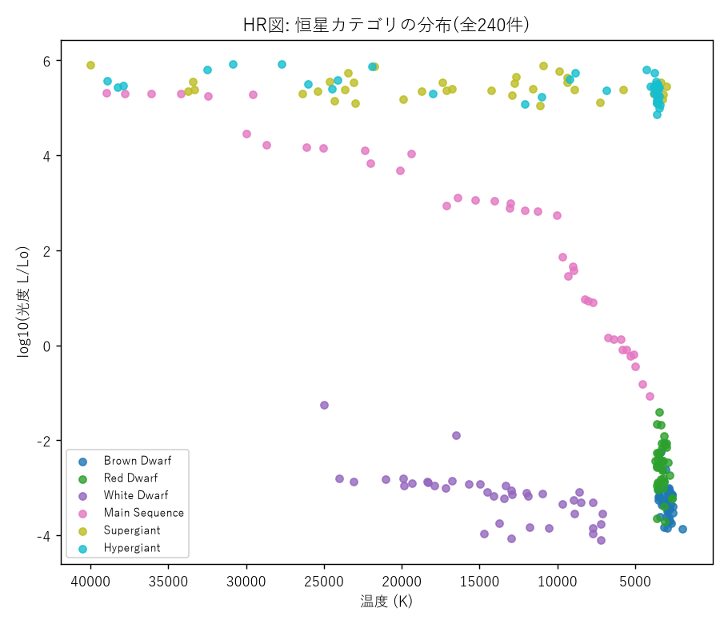
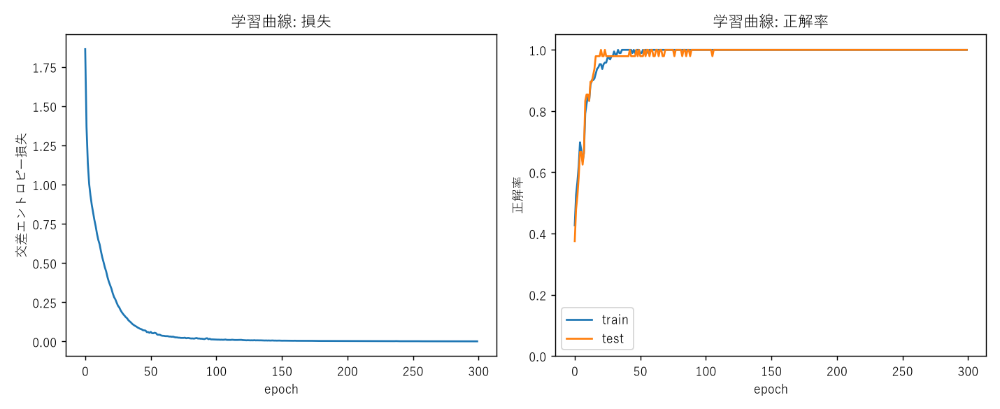
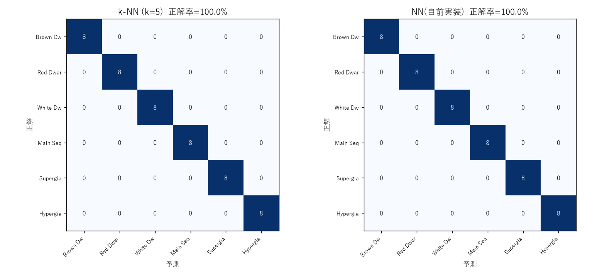

# Star Classifier NN — 恒星分類: k-NN vs 自作ニューラルネットワーク

HR図(温度・光度などから恒星のタイプを分類する天文学の古典的な問題)を題材に、
k近傍法(k-NN)とニューラルネットワーク(NN)という2つの教師あり学習手法を同一条件で比較するプロジェクトです。

以前Javaで実装したk-NN分類器([StarClassifier.java](https://github.com/YBIFoundation/Dataset)のデータを使用)の続編として、今回はPythonで、

1. 同じデータセット・同じ特徴量・同じtrain/testスプリットでk-NNを再実装し、
2. NumPyのみで全結合ニューラルネットワーク(softmax出力+交差エントロピー損失、Adam最適化)を自前実装して学習させ、
3. 両者の精度・混同行列を公平に比較しています。

外部の機械学習フレームワーク(scikit-learn, PyTorch等)は使用せず、k-NN・NNともにNumPy配列演算のみで実装しています。

## データ

[YBI Foundation "Stars.csv"](https://github.com/YBIFoundation/Dataset)(240件、6クラス×各40件)を使用。

- 特徴量: Temperature(K), log10(Luminosity), log10(Radius), Absolute magnitude(Mv)
- 目的変数: Star category(Brown Dwarf / Red Dwarf / White Dwarf / Main Sequence / Supergiant / Hypergiant)

## 構成

```
star_classifier_nn/
├── data_prep.py       データ読み込み・標準化・層化80/20分割
├── knn_baseline.py     k-NN(k=5)によるベースライン分類
├── neural_network.py   NumPyのみで実装したNN(softmax + 交差エントロピー + Adam)
├── train_nn.py          NN分類器の学習・評価
├── visualize.py         学習曲線・HR図・混同行列の可視化
├── data/                stars.csv
├── results/              評価結果の図
└── requirements.txt
```

## 手法

### データ分割(data_prep.py)

クラスごとに層化した80/20分割(seed=42)。以前のJava版k-NNと同じ分割ロジックを再現しており、k-NN・NNの両方が全く同じ訓練192件・テスト48件を使用する。

### k-NNベースライン(knn_baseline.py)

標準化した4特徴量に対しユークリッド距離でk=5近傍を取り、多数決で分類。

### ニューラルネットワーク(neural_network.py, train_nn.py)

- 全結合層(4→32→16→6)、隠れ層はtanh、出力層はsoftmax
- 損失関数: 交差エントロピー
- 最適化: Adam(自前実装)、300エポック、ミニバッチサイズ32

## 結果

| 手法 | テスト正解率 |
|---|---|
| k-NN (k=5) | 100.0% (48/48) |
| NN(自前実装) | 100.0% (48/48) |

このデータセットは温度・光度・半径・絶対等級から恒星カテゴリがほぼ決定論的に定まる(HR図上で各カテゴリが明瞭に分離する)ため、シンプルなk-NNでも複雑なNNでも同等に高精度な分類が可能という結果になった。`results/hr_diagram.png`を見ると、6カテゴリが温度-光度平面上で綺麗に分かれていることが分かる。

NNの学習曲線(`results/learning_curve.png`)では、20エポック程度で急速に収束し、以降は損失が単調に減少している。過学習の兆候(train/testの乖離)も見られない。

### 図







## 実行方法

```bash
pip install -r requirements.txt

cd star_classifier_nn
python data_prep.py    # データ確認
python knn_baseline.py  # k-NNベースライン
python train_nn.py      # NN学習・評価
python visualize.py     # 図の生成 (results/ に出力)
```

Python 3.9以降、NumPy・Matplotlibのみで動作します(乱数シード固定で再現可能)。

## 今後の課題

- このデータセットでは分類が容易すぎるため、意図的にノイズを加えた場合の頑健性比較
- 特徴量を減らした場合(例: 温度のみ)にk-NNとNNの精度差が生まれるかの検証
- 隠れ層構成・活性化関数による収束速度の比較

## 関連リポジトリ

- [computer-simulation-final-project](https://github.com/saki-nya1539/computer-simulation-final-project) — 本プロジェクトの前身となったJava実装(k-NN, k-means, TF-IDFによるコンピュータシミュレーション最終課題)
